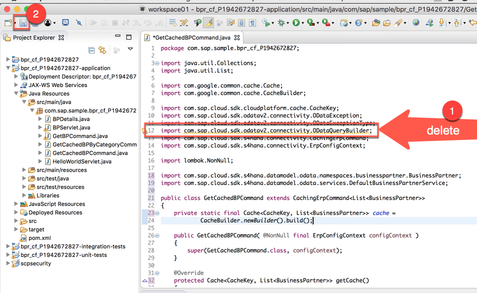
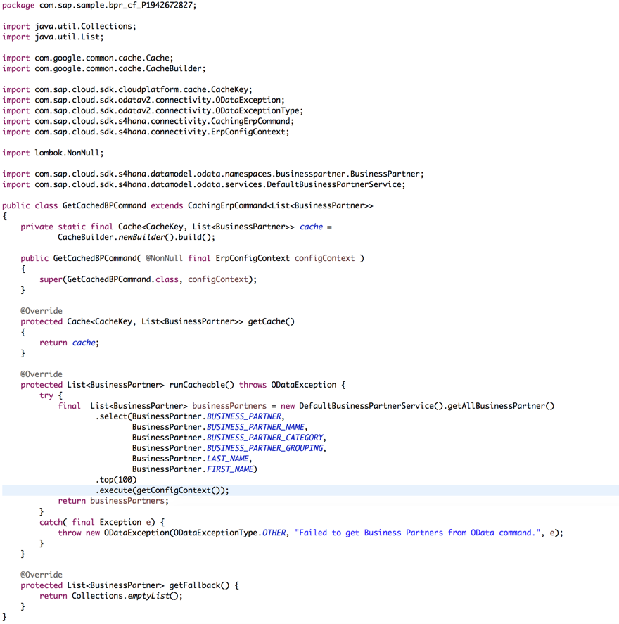
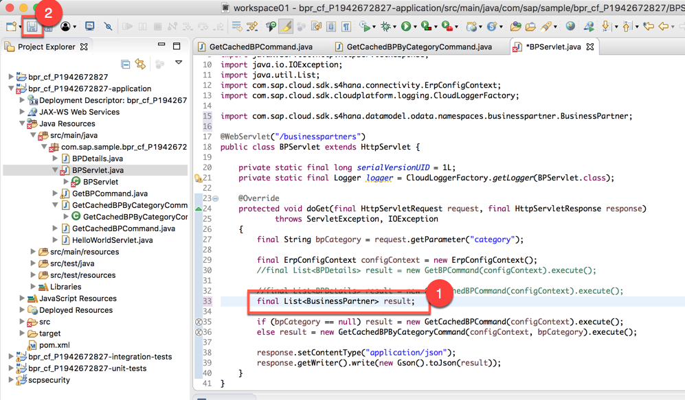
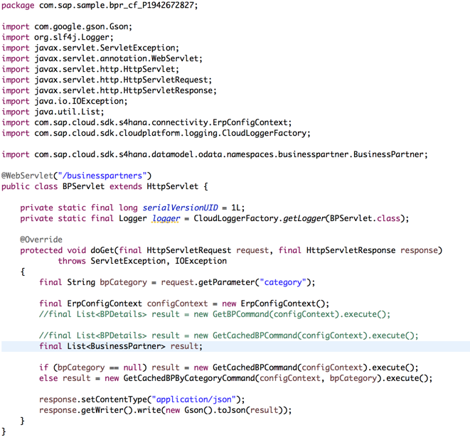
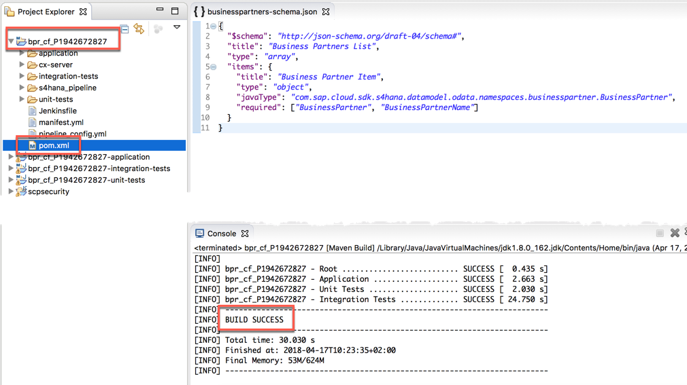

<table width=100% border=>
<tr><td colspan=2><h1>EXERCISE 2_1 - VIRTUAL DATA MODEL(VDM)</h1></td></tr>
<tr><td><h3>SAP Partner Workshop</h3></td><td><h1> &nbsp;60 min</h1></td></tr>
</table>


## Description

In this exercise, you’ll learn how to 

* introduce Virtual Data Model (VDM) into your application

The data stored in an S/4HANA system is inherently complexly structured and therefore difficult to query manually. For this reason, HANA introduced a Virtual Data Model (VDM) that aims to abstract from this complexity and provide data in a semantically meaningful and easy to consume way. The preferred way to consume data from an S/4HANA system is via the OData protocol. While BAPIs are also supported for compatibility reasons, OData should always be your first choice. You can find a list of all the available OData endpoints for S/4HANA Cloud systems in [SAP’s API Business Hub](https://api.sap.com/shell/discover/contentpackage/SAPS4HANACloud?section=ARTIFACTS).

The S/4HANA Cloud SDK now brings the VDM for OData to the Java world to make the type-safe consumption of OData endpoints even more simple! The VDM is generated using the information from SAP’s API Business Hub. This means that it’s compatible with every API offered in the API Business Hub and therefore also compatible with every S/4HANA Cloud system.

Looking at the code you wrote previously

```java
final List<BPDetails> businessPartners =
    ODataQueryBuilder
        .withEntity("/sap/opu/odata/sap/API_BUSINESS_PARTNER", "A_BusinessPartner")
        .select("BusinessPartner", "BusinessPartnerName", "BusinessPartnerCategory", "BusinessPartnerGrouping", "LastName","FirstName")
        .top(100)
        .build()
        .execute(getConfigContext())
        .asList(BPDetails.class);
```

you can see that, in order to retrieve Business Partners, you already had to know three things:

- the OData endpoints service path (`/sap/opu/odata/sap`)
- the endpoints name (`API\_BUSINESS_PARTNER`)
- the name of the entity collection (`A_BusinessPartner`) as defined in the endpoints metadata.

Then, when you want to select specific attributes from the BusinessPartner entity with the **select()** function, you need to know how these fields are called. But since they are only represented as strings in this code, you need to look at the metadata to find out how they’re called. The same also applies for functions like orderBy() and filter(). And of course using strings as parameters is prone to spelling errors that your IDE most likely won’t be able to catch for you.

Finally, you need to define a class such as `BPDetails` with specific annotations that represents the properties and their types of the result. For this you need again to know a lot of details about the OData service.

Now, with **VDM**, it's all much easier!

Using VDM you have access to an object representation of a specific OData service, in this case the `BusinessPartnerService`, so there’s no more need to know the endpoint’s service path, service name or entity collection name. We can call this service’s `getAllBusinessPartner()` function to retrieve a list of all the business partners from the system.

Now take a look at the **select()** function. Instead of passing strings that represent the field of the entity, we can simply use the static fields provided by the BusinessPartner class. So not only we have eliminated the risk of spelling errors, we also made it type-safe! Again, the same applies for filter() and orderBy(). For example, filtering to a specific business partner category becomes as easy as `.filter(BusinessPartner.BUSINESS_PARTNER_CATEGORY.eq(bpCategory))`.

An additional benefit of this approach is **discoverability**. Since everything is represented as code, you can simply use your IDE’s autocompletion features to see which functions a service supports and which fields an entity consists of: start by looking at the different services that are available in the package `com.sap.cloud.sdk.s4hana.datamodel.odata.services`, select the service you need, and then look for the static methods of the service class that represent the different available operations. Based on this, you can choose the fields to select and filters to apply using the fields of the return type.

To sum up the advantages of the OData VDM:

- No more hardcoded strings
- No more spelling errors
- Type safety for functions like filter, select and orderBy
- Java data types for the result provided out of the box, including appropriate conversions
- Discoverability by autocompletion
- Currently the VDM supports retrieving entities by key and retrieving lists of entites along with filter(), select(), orderBy(), top() and skip(). You can also resolve navigation properties on demand and use function imports. Future releases will bring even more enhancements to its functionality.

For further reading on SAP S/4HANA Cloud SDK, click link below.
<https://www.sap.com/germany/developer/topics/s4hana-cloud-sdk.html>


## Target group

* Developers
* People interested in learning about S/4HANA extension and SDK  


## Goal

The goal of this exercise is to understand the usage of Virtual Data Model(VDM).  

## Prerequisites
  
Here below are prerequisites for this exercise.

* A trial account on the SAP Cloud Platform. You can get one by registering [here](https://account.hanatrial.ondemand.com)
* Apache Maven 3.3.9+ [download it here](https://maven.apache.org/download.cgi)
* Java JDK 8
* Cloud Foundry CLI [download it here](https://github.com/cloudfoundry/cli)
* The source code created in the previous exercise
* A S/4HANA system with a working communication arrangement for the Business Partners collection


## Steps

1. [Implement VDM](#implement-vdm)


### <a name="implement-vdm"></a>Implement VDM
In this chapter you are going to see how to implement Virtual Data Model in your application. Specifically, you are going to change the two latest classes introduced after implementing caching and resilience, **GetCachedBPCommand** and **GetCachedBPByCategoryCommand**.

1. Let's start with **GetCachedBPCommand**. Open this class and add a couple of new imports to the class

	```java
	import com.sap.cloud.sdk.s4hana.datamodel.odata.namespaces.businesspartner.BusinessPartner;
	import com.sap.cloud.sdk.s4hana.datamodel.odata.services.DefaultBusinessPartnerService;
	```

	

1. Replace the line

	```java
	final List<BPDetails> businessPartners =
	    ODataQueryBuilder
	        .withEntity("/sap/opu/odata/sap/API_BUSINESS_PARTNER", "A_BusinessPartner")
	        .select("BusinessPartner", "BusinessPartnerName", "BusinessPartnerCategory", "BusinessPartnerGrouping", "LastName","FirstName")
	        .top(100)
	        .build()
	        .execute(getConfigContext())
	        .asList(BPDetails.class);
	```
	
1. with the following:

	```java
	final  List<BusinessPartner> businessPartners = new DefaultBusinessPartnerService().getAllBusinessPartner()
	        .select(BusinessPartner.BUSINESS_PARTNER,
	                BusinessPartner.BUSINESS_PARTNER_NAME,
	                BusinessPartner.BUSINESS_PARTNER_CATEGORY,
	                BusinessPartner.BUSINESS_PARTNER_GROUPING,
	                BusinessPartner.LAST_NAME,
	                BusinessPartner.FIRST_NAME)
	        .top(100)
	        .execute(getConfigContext());
	```
  
	

1. Of course, doing this you introduced some errors in the code. No worries!. You just need to replace all the **BPDetails** references (5 matches) with **BusinessPartner**, because now we are no longer using the BPDetails class we have defined, but the predefined one coming from the VDM. Go to the **Edit->Find/Replace** menu, enter "BPDetails" in the find box and "BusinessPartner" in the replace box and click **Replace all**. You should have just 5 matches   
	

1. Feel free to remove the **OdataQueryBuilder** import from the class because it's no longer needed; then **save** the file   
	

1. This is the final code for this class
	

1. The same changes must be done to the second class **GetCachedBPByCategoryCommand**. The only difference here is that here we need also to introduce a line for filtering all the Business Partners by the passed category `.filter(BusinessPartner.BUSINESS_PARTNER_CATEGORY.eq(bpCategory))`. You can delete the unused imports related to ODataProperty, ODataQueryBuilder, ODataType. This is the final code of this class  

	

1. Finally, the **BPServlet** class must be changed accordingly as well. First add this new import to the file

	```java
	import com.sap.cloud.sdk.s4hana.datamodel.odata.namespaces.businesspartner.BusinessPartner;
	```  

	

1. Then change this line 

	```java
	final List<BPDetails> result;
	```
	
	with the following and **save** the file

	```java
	final List<BusinessPartner> result;
	```
  
	

1. This is the final version of this class 
	

1. There are no more syntax errors now, but if you try to build the project with Maven as it is, you will get some errors in the test phase  
	

1. So we need to adjust the tests as well, because they are no longer aligned with the latest changes. Go to */integration-tests/src/test/resources/businesspartners-schema.json*  
	

1. There are a few things to change here. First of all we beed to replace the **javaType** with `com.sap.cloud.sdk.s4hana.datamodel.odata.namespaces.BusinessPartnerNamespace.BusinessPartner`. Then we need to change the names of the required fields, because they are now coming directly from the BusinessPartnerService and are different. This is the final file

	```json
	{
	  "$schema": "http://json-schema.org/draft-04/schema#",
	  "title": "Business Partners List",
	  "type": "array",
	  "items": {
	    "title": "Business Partner Item",
	    "type": "object",
	    "javaType": "com.sap.cloud.sdk.s4hana.datamodel.odata.namespaces.businesspartner.BusinessPartner",
	    "required": ["BusinessPartner", "BusinessPartnerName"]
	  }
	}
	```  
	

1. Save the file and rebuild the root project again. It should end with a success  
	

1. Push the application again with the `cf push` command  
	

1. The application should be still working fine. 
	>NOTE: now the field names are different beacuse we are using VDM, taking the output coming directly from the BusinessPartnerService    

	

1. You have successfully implemented VDM in your application.


## Summary
This concludes the exercise. You should have learned how to introduce Virtual Data Model in your service. Please proceed with the next exercise.
