<table width=100% border=>
<tr><td colspan=2><h1>PREREQUISITES</h1></td></tr>
<tr><td><h3>SAP Partner Workshop</h3></td><td><h1> &nbsp;60 min</h1></td></tr>
</table>


## Description
In this exercise, you’ll go through the basic steps of setting up the development environment required for S/4HANA Cloud extension workshop.


## Target group

* Application Developers
* People interested in learning about S/4HANA extension and SDK  


## Goal

The goal of this exercise is to have your workstation well prepared in order to attend to the S/4HANA Cloud extension workshop.


## Prerequisites
  
Here below are prerequisites required for the exercises in this workshop.

1. [Install Eclipse Oxygen](#install-eclipse-oxygen)
1. [Install SAP Cloud Platform Eclipse Oxygen Plugins](#install-cp-oxygen-plugin)
1. [Install Java JDK](#install-java-jdk)
1. [Install Postman](#install-postman)
1. [Install NodeJS](#install-nodejs)
1. [Configure Eclipse Oxygen Java preference](#configure-eclipse-java)
1. [Install SAP Cloud Platform SDK](#install-cp-sdk)
1. [Create a new Neo Runtime Environment](#create-runtime-environment)
1. [Sign up for SAP Cloud Platform Neo trial account](#sign-up-neo)
1. [Sign up for SAP Cloud Platform Cloud Foundry trial account](#sign-up-cf)
1. [Install Cloud Foundry CLI](#install-cf-cli)
1. [Install Apache Maven for Windows/Mac](#install-maven)
1. [Check if Eclipse/Maven is installed and Java set-up is done correctly](#check-eclipse-maven)
1. [Install Eclipse YML plugin](#eclipse-yml-plugin)


### <a name="install-eclipse-oxygen"></a>Install Eclipse Oxygen
Eclipse Oxygen IDE is required for Java application development during the workshop.

1.	Download and install **Eclipse Oxygen IDE for Java EE Developers**

	#### For Windows:
	<http://www.eclipse.org/downloads/download.php?file=/technology/epp/downloads/release/oxygen/3/eclipse-jee-oxygen-3-win32-x86_64.zip>  
	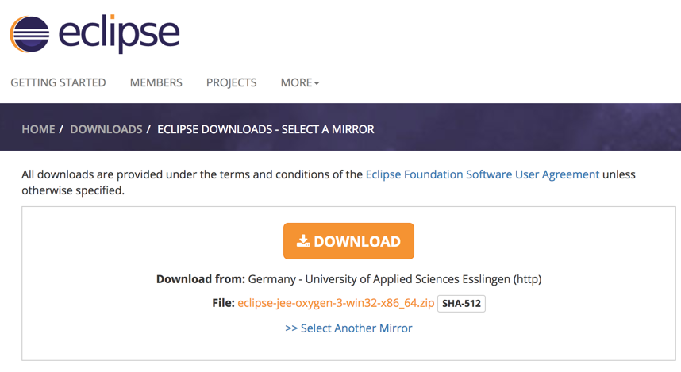

	#### For Mac:
	<http://www.eclipse.org/downloads/download.php?file=/technology/epp/downloads/release/oxygen/3/eclipse-jee-oxygen-3-macosx-cocoa-x86_64.dmg>  
	


### <a name="install-cp-oxygen-plugin"></a>Install SAP Cloud Platform Eclipse Oxygen Plugins
Install SAP Cloud Platform Eclipse Oxygen Plugins

1.	Open **Eclipse Oxygen**
1. Click on **Help -> Install New Software…**  
	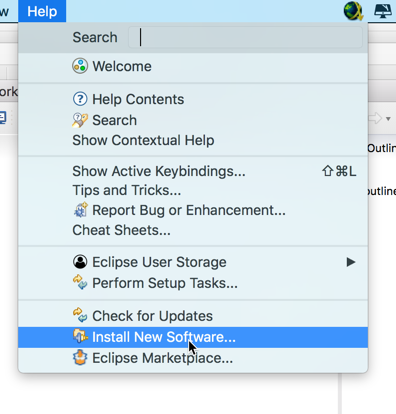
1. Enter this link <https://tools.hana.ondemand.com/oxygen/> and hit **ENTER**; if requested, type a description for this repository and click **OK**  
	
1. Select **SAP Cloud Platform Tools** and click **Next**   
	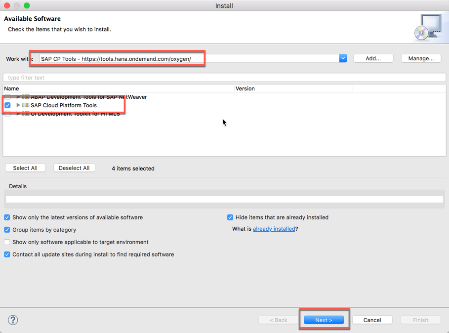
1. Click **Next**  
	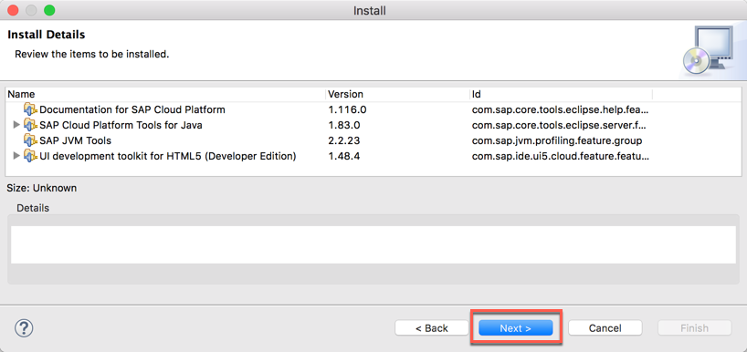
1. Accept the license agreement and click **Finish**  
	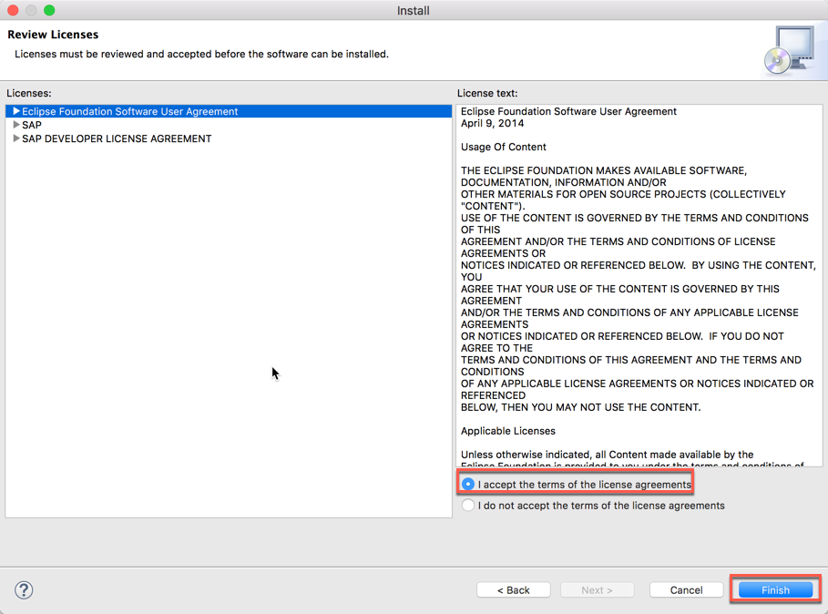
1. Select **Install anyway**  
	
1. Click **Restart Now** to restart Eclipse  
	


### <a name="install-java-jdk"></a>Install Java JDK
Eclipse IDE needs Java JDK.

1.	Download and install Java JDK from this link <http://www.oracle.com/technetwork/java/javase/downloads/jdk8-downloads-2133151.html>  
	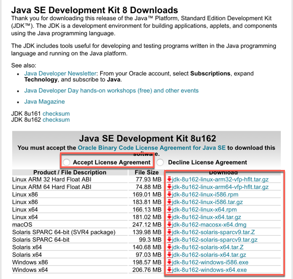


### <a name="install-postman"></a>Install Postman
Postman is a REST client which will be needed to test if the endpoint generated by the new Communication Arrangement works fine.

1. Download Postman from from [here](https://www.getpostman.com) and install it  
	

### <a name="install-nodejs"></a>Install NodeJS
NodeJS is needed in the last exercise of Day 2. This is will also install the NodeJS Package Manager (npm). 

1. Close any Terminal window on your machine

1. Download the latest **LTS** version of NodeJS from from [here](https://www.nodejs.org)
	

1. Install it according to your operating system


### <a name="configure-eclipse-java"></a>Configure Eclipse Oxygen Java preference
Make sure Eclipse IDE uses right JREs.

1.	Click on **Window -> Preferences**. This should open the Preferences window. If you are on MAC you can find Preferences item under the Eclipse menu  
	
1. Search for **Installed JREs**
	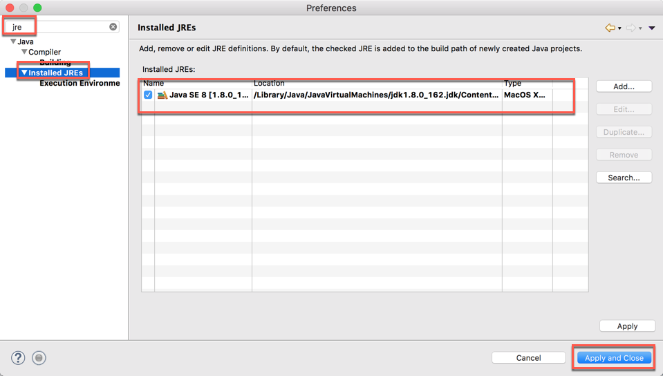

> NOTE: Make sure that the location is pointing your Java JDK 1.8 instead of your Java JRE


	 
### <a name="install-cp-sdk"></a>Install SAP Cloud Platform Neo Environment SDK
Neo commands used during S/4HANA extension development are part of SAP Cloud Platform SDK.

1. Download the latest version of Java Web Tomcat 8 Neo Environment SDK from here <https://tools.hana.ondemand.com/#cloud>
	
	
1. Extract it in a folder on your disk

1. You will need this SDK in the Exercise 13 where you are going to start a Java Web Tomcat 8 server.

 
### <a name="create-runtime-environment"></a>Create a new Neo Runtime Environment
During Java application deployment to SAP Cloud Platform, you will be using Java EE 6 Web Server runtime.

1. Download the latest version of Java EE 7 Web Profile TomEE 7 from here <https://tools.hana.ondemand.com/#cloud>  
	

1. Extract it in a folder on your disk

1.	From Eclipse Oxygen, go to **Preferences** window. Search for **runtime** and, under the path **Server -> Runtime Environments** click **Add**  
	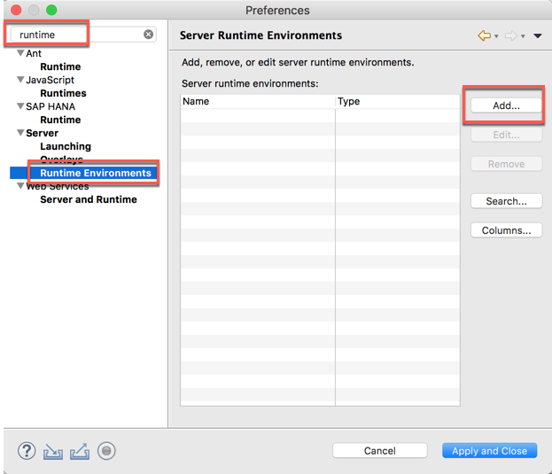

1.	Under **SAP** catalog, select **Java EE 7 Web Profile TomEE 7** and click **Next**  
	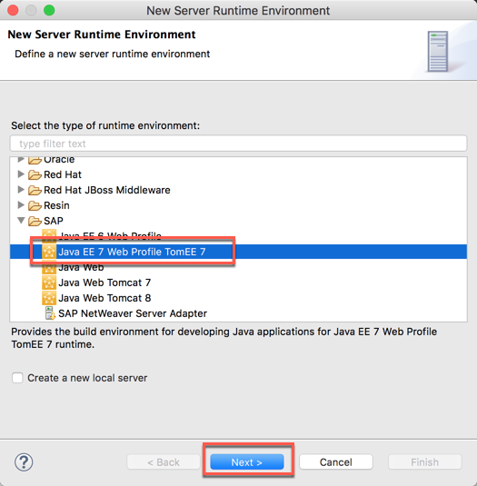

1.	Browse to the location of the Java EE 7 Web Profile TomEE 7 folder you have just extracted and click **Finish**  
	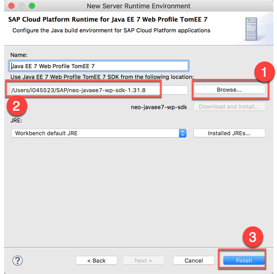

1.	Java EE 7 Web Profile is installed. Click on **Apply and Close**    
	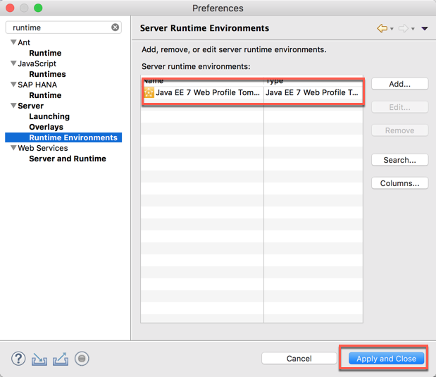


 

### <a name="sign-up-neo"></a>Sign up for SAP Cloud Platform Neo trial account
You need Neo trial SAP Cloud Platform to complete standalone hands-on exercise for Workflow Service and Business Rules Service. 

1.	Sign up for SAP Cloud Platform trial account from <https://account.hanatrial.ondemand.com/> by clicking on the **Register** button. If you already have an account on the Trial landscape please login with that account
	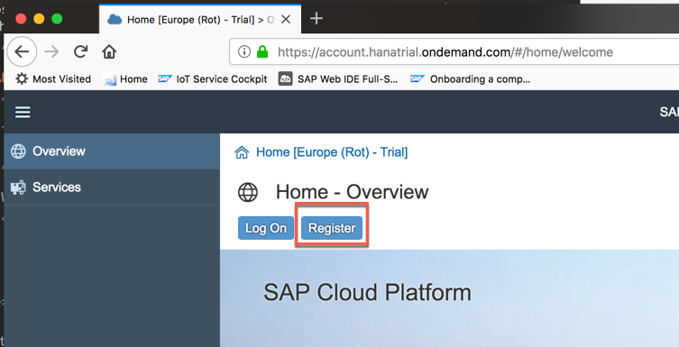

1. After you have logged in, click on **Neo Trial**  
	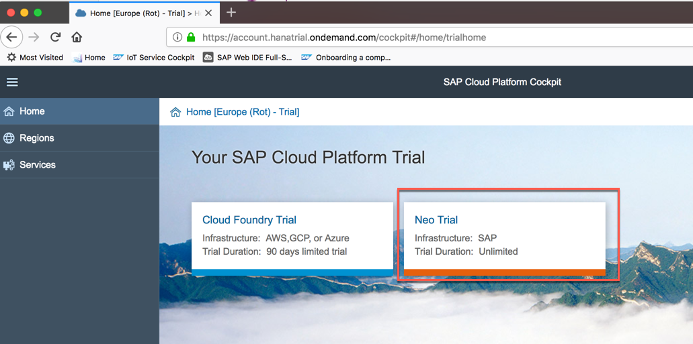

1. This will take you to the **Overview** page of the SAP Cloud Platform Cockpit for the Neo stack
	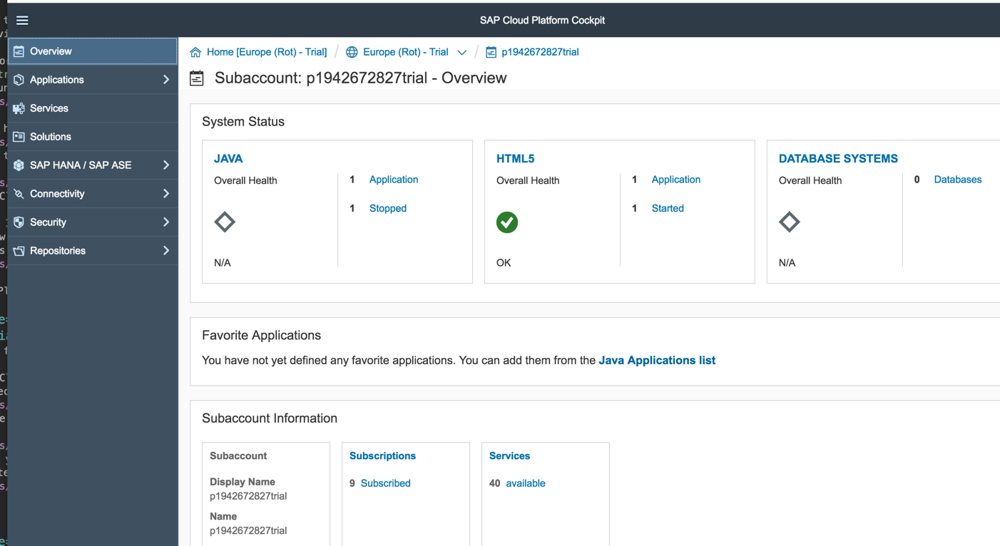

1.	From SAP Cloud Platform Cockpit, click on **Services**. Enable the Portal service	
	 
	> **NOTE**: Portal service must be enabled first.

1.	At the same way enable these further services
	- SAP Web IDE Full-Stack
	- Workflow
	- Business Rules
	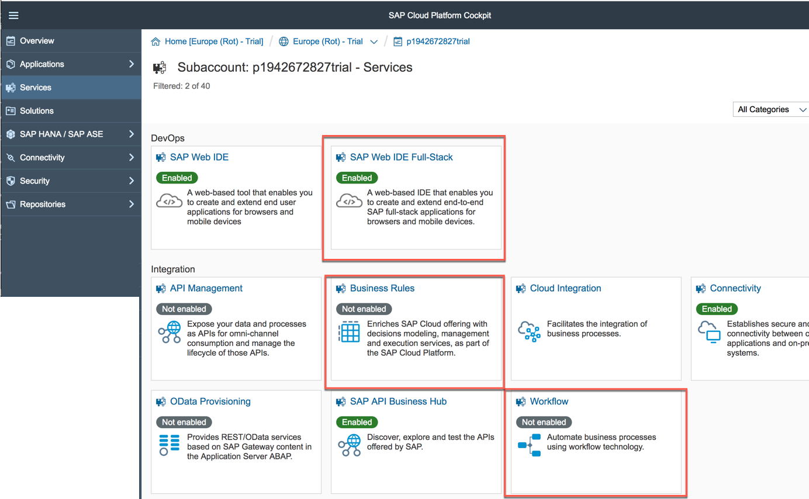
	
        
### <a name="sign-up-cf"></a>Sign up for SAP Cloud Platform Cloud Foundry trial account
Sign up also for SAP Cloud Platform Cloud Foundry trial account.

1.	From SAP Cloud Platform Cockpit, click on **Cloud Foundry Trial**. This will bring you directly into your Cloud Foundry Trial subaccount. 
	

2. If you already have activated this kind of landscape in the past, consider that it might be expired since the validity is only **30 days**. All you have to do is to reactivate the trial by going on the first icon in the top toolbar and selecting **Extend Free Trial**. Then you have to refresh your browser. The button for extending free trial is only available after your trial plan is expired
	

1.	Select your trial sub-account
		 

1.	You should have just one space. Click on it
		 

1.	Make sure you have **2GB Memory** for your space. If you don’t have 2GB Memory, please register a new account.
	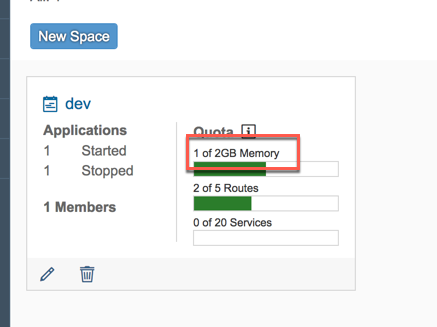


### <a name="install-cf-cli"></a>Install Cloud Foundry CLI
Install Cloud Foundry CLI  

1.	Cloud Foundry CLI can be downloaded here <https://github.com/cloudfoundry/cli#downloads>. Just select the installer which matches your Workstation's Operating System
	

1. Once downloaded the file, please install it by double clicking on the downloaded file.


### <a name="install-maven"></a>Install Apache Maven for Windows/Mac
You might need Maven tool installed on you workstation. Here are the steps to install Maven.

#### WINDOWS

1.	Install Chocolatey (a package manager for Windows)

```sh	
@powershell -NoProfile -ExecutionPolicy Bypass -Command "iex ((New-Object System.Net.WebClient).DownloadString('https://chocolatey.org/install.ps1'))" && SET "PATH=%PATH%;%ALLUSERSPROFILE%\chocolatey\bin"
```

2.	Install Maven

```sh
	choco install maven
```

#### MAC

1.	Install HomeBrew (a package manager for Mac)

```sh	
/usr/bin/ruby -e "$(curl -fsSL https://raw.githubusercontent.com/Homebrew/install/master/install)"
```

2.	Install Maven

```sh
	brew update
	brew install maven
```


### <a name="check-eclipse-maven"></a>Check if Eclipse/Maven is installed and Java set-up is done correctly
Building successfully a Maven-based Java project in your Eclipse is a prerequisite.
You are ready to test if you can build and run a Java Web application project with Maven in your Eclipse IDE. For this test we prepared a Maven-based HelloWorld Java project you can import and run.

1. Download the archive file [helloworld.zip](files/helloworld.zip?raw=true).

1. Extract the *helloworld.zip* archive to a directory of your choice

1. From the Eclipse menu, choose **File -> Import…** to open the Import wizard  
	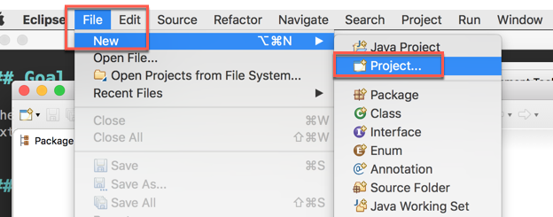

1. Choose **Maven->Existing Maven Projects** and click **Next**  
	

1. In the Import Maven Projects dialog:
	- Click **Browse** and select the helloworld directory where you have extracted the *helloworld.zip*
	- The *helloworld/pom.xml* will be listed in the Projects section
	- Select the checkbox of this *pom.xml*
	- Choose **Finish** to start importing the Maven project into your Eclipse workspace
	  
	
	>**Info**: POM is an acronym for Project Object Model. It is an XML representation of a Maven project held in a file named *pom.xml*. For more information see the Maven documentation.

1. In the Project Explorer view of the Java EE Perspective you should find now the imported *helloworld*  
	

1. Right-click on the *helloworld* project node to open the Context Menu. Choose **Run As -> Maven install** to start the Maven build for the *helloworld* project  
	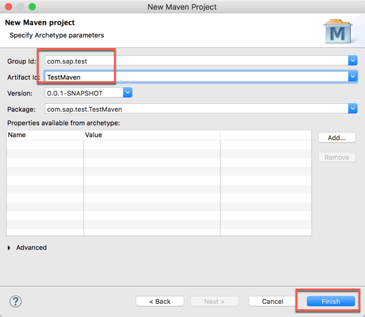

1. The Eclipse IDE will open a Console Tab that displays the build progress. You should see **BUILD SUCCESS**. If your build was not successful, please check the troubleshooting guide for Maven  
	

1. In Project Explorer view expand the project node **helloworld -> target** to find the built *helloworld.war* file.

	> Note: To see it you might have to refresh the project by right-clicking on the project-node and press Refresh  
	
	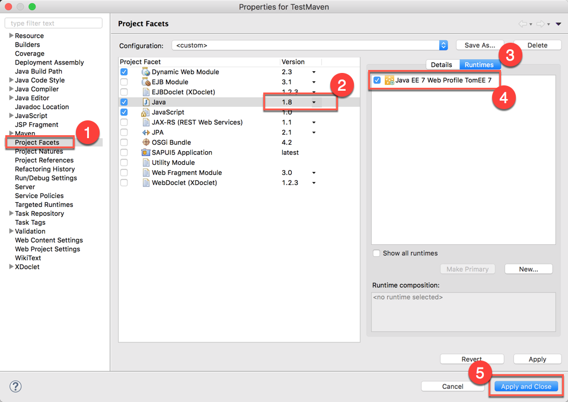
	
1.  Maven has build successfully the *helloworld* Java web application and created a *helloworld.war* file (see console output for the location).


### <a name="eclipse-yml-plugin"></a>Install Eclipse YML plugin
1. It's important for the next exercises to install an Eclipse plugin which allows us to easily manage **YAML** files. 

2. Open Eclipse IDE and click on **Help -> Eclipse Marketplace...**  
	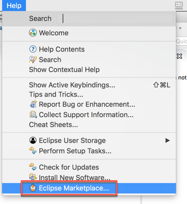

1. Enter the text "**yml**" in the search box and install the **YEdit** plugin  
	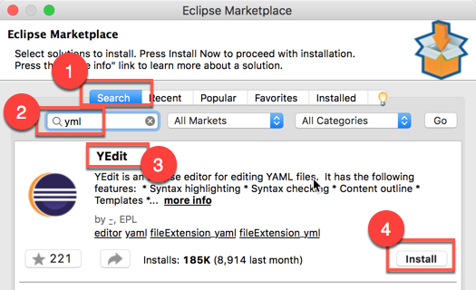

1. Accept the license agreement and click **Finish**  
	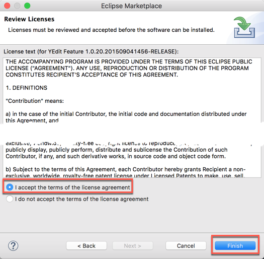

1. Click **Install anyway**  
	

1. Restart Eclipse  
	


## Summary
You have successfully completed the prerequisites installation.
